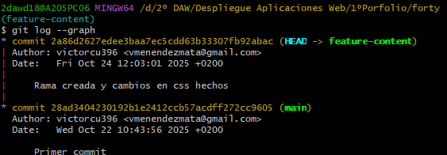

# Ejercicio de Git - Forty - local y remoto

# Trabajo en Local

1. Inicializa un nuevo repositorio Git en una carpeta llamada proporcionados en el aula virtual.

```bash
git init
```

1. Renombra la rama master a main.

```bash
git branch -m main
```

1. Haz que los ficheros README.txt , LICENSE.txt y passwords.txt sean ignorados por el control de versiones.

```bash
git rm --cached README.txt
git rm --cached LICENSE.txt
git rm --cached passwords.txt
```

1. Crea el archivo passwords.txt. Comprueba que el control de versiones lo ignora.

```bash
echo 'admin123' > password.txt
git status
```

1. Crea una rama llamada "feature-content" . Muévete a esa rama. Cambia, en la línea 3477, el font-size por 1.5em en el archivo main.css . Confirma cambios y haz commit. Muestra los logs de la forma más gráfica posible.

```bash
git branch feature-content
git checkout feature-content
git add .
git log --graph
```



1. Elimina el archivo "passwords.txt" en la carpeta forty . Verifica el estado del repositorio. ¿Hay cambios pendientes?

```bash
rm password.txt
git status
```

1. Crea un nuevo archivo llamado " about.html ", partiendo del archivo generic.html y agrégalo al repositorio, haz un nuevo commit.

```bash
cp generic.html about.html
git add .
git commit -m "Nuevo archivo creado"
```

1. Cambia a la rama main . Examina los logs del repositorio de forma gráfica.

```bash
git checkout main
git log --graph --all
```


1. Modifica algo en el archivo generic.html , comprueba que hay cambios, y realiza otro commit . Examina los logs del repositorio de forma gráfica.

```bash
git status
git add .
git commit -m "Cambios en generic.html hechos"
git log --graph --all
```


1. Modifica algo en el fichero elements.html . Confirma los cambios, pero no hagas commit.

```bash
git add .
```

1. Mira las diferencias de elements.html . Los cambios no nos gustan, deshaz los cambios de elements.html . Comprueba que no hay cambios pendientes.

```bash
git diff elements.html
git restore elements.html
git status
```

1. Muestra las diferencias entre dos ramas.

```bash
git diff main feature-content
```

1. Fusiona la rama "feature-content" con la rama principal (main). Muestra los logs del repositorio de una forma gráfica y completa.

```bash
git merge feature-content
git log --graph --all
```


1. Crea una nueva rama llamada " hotfix " y en ella, corrige un error crítico en el archivo " index.html ". (Por ejemplo, añade el enlace a la nueva página about.html).

```bash
git branch hotfix
git checkout hotfix
git add .
git commit -m "Cambios en index.html realizados"
```

1. Fusiona la rama "hotfix" con la rama principal y verifica el historial de commits de forma que se vean todas las ramas gráficamente. ¿Borrarías la rama hotfix ? ¿En qué caso? ¿Cómo?

```bash
git checkout main
git merge hotfix
git log
```


1. Muestra el historial de cambios limitado a los últimos 3 commits.

```bash
git log -n 3
```


1. Etiqueta el commit actual como "v1.0" y muestra las etiquetas existentes.

```bash
git tag V1.0
git tag
```

# Trabajo en Remoto

1. Sube al remoto los ficheros de tu repositorio local.

```bash
git remote add origin https://github.com/victorcu396/forty.git
git push -u origin main
```

1. En local, crea una rama 'feature-head'. Cambia el título en la sección head de index.html , borra los comentarios del head , o previos, también. Confirma y sube los cambios al remoto.

```bash
git branch feature-head
git checkout feature-head
git add .
git commit -m "Index.html cambiado y borrado de comentarios"
git push origin feature-head
```

1. En remoto, crea una rama 'feature-articulo'. Duplica la página generic , nómbrala como articulo.html , y añade como contenido un artículo sobre Git. Confirma los cambios y realiza un commit. Muestra los commits del repositorio tal como se ven en GitHub

```bash
git pull
git log --graph --all
```


1. En el repositorio local examina los cambios. Actualiza el repositorio con el remoto. Fusiona en 'main' las dos ramas 'feature'. Crea la etiqueta 'v2.0'. Muestra los logs, commits, etiquetas y ramas actuales, en local y en remoto

```bash
git checkout main
git add .
git merge feature-head
git merge feature-articulo
git commit -m "Ramas fusionadas"
```


1. En tu copia local, crea una rama nueva . En la rama nueva, cambia los enlaces de la página index.html para que apunten correctamente a la nueva página articulo.html . Confirma los cambios.