# Ejercicios Linux

[TOC]

  

## Ejercicios Capítulo 2

### 1. ¿En qué directorio se encuentran los ficheros de configuración del sistema? 


### 2. Para entrar en un sistema Linux hace falta a) nombre de usuario, contraseña y dirección IP, b) nombre de usuario y contraseña o c) únicamente una contraseña..


### 3. Muestra el contenido del directorio actual. 

```bash
~$ ls
```

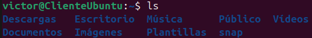
### 4. Muestra el contenido del directorio que está justo a un nivel superior. 

```bash
~$ ls -d ../*/
```

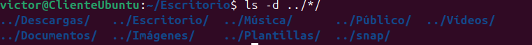

### 5. ¿En qué día de la semana naciste?, utiliza la instrucción cal para averiguarlo

```bash
~$ cal 18 2006
```
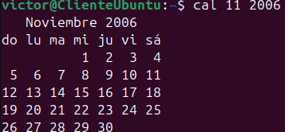


### 6. Muestra los archivos del directorio /bin

```bash
~$ ls /bin/
```
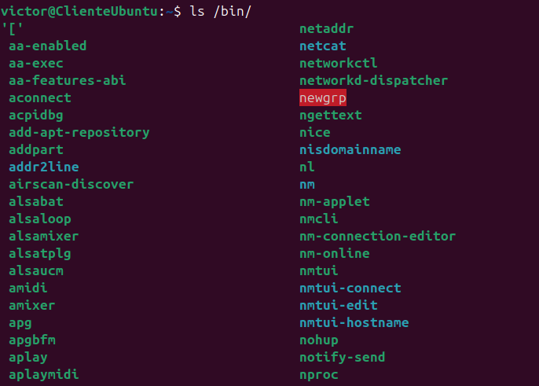

### 7. Suponiendo que te encuentras en tu directorio personal (/home/nombre), muestra un listado del contenido de /usr/bin a) con una sola línea de comando, b) moviéndote paso a paso por los directorios y c) con dos líneas de comandos.

a)

```bash
~$ ls /usr/bin
```

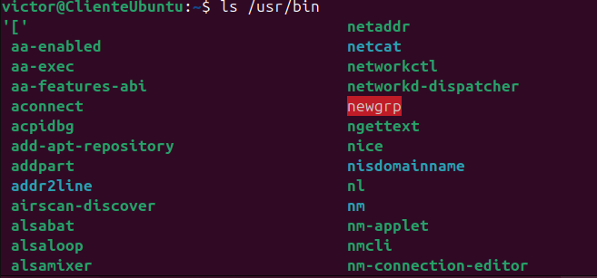

b)

```bash
~$ pwd
~$ cd ..
/home$ cd ..
/$ ls
/$ cd usr
/usr$ cd bin
/usr/bin$ ls
```

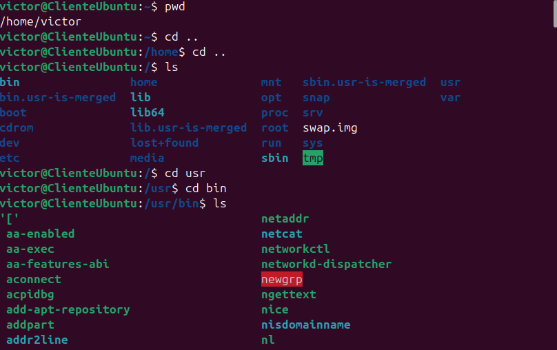

c)

```bash
~$ cd /usr/bin
/bin$ ls
```

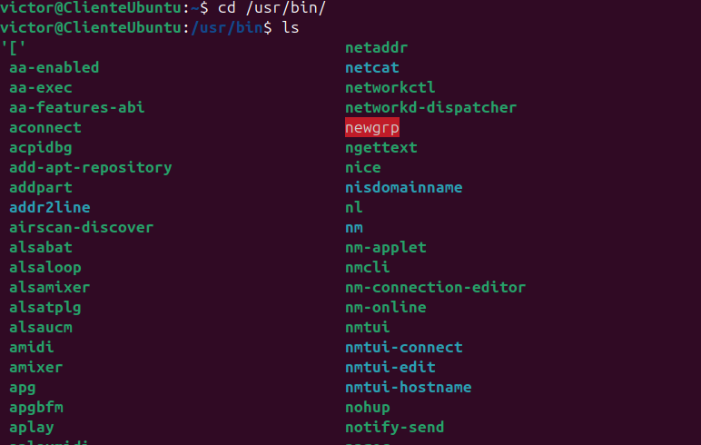

### 8. Muestra todos los archivos que hay en /etc y todos los que hay dentro de cada subdirectorio, de forma recursiva (con un solo comando).

```bash
/$ ls /etc/*/
```

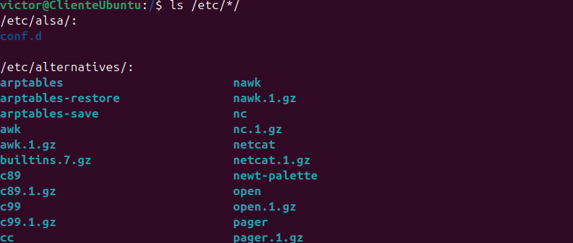

### 9. Muestra todos los archivos del directorio /usr/X11R6/bin ordenados por tamaño (de mayor a menor). Sólo debe aparecer el nombre de cada fichero, sin ninguna otra información adicional.

```bash
/$ ls -S /usr/bin/
```

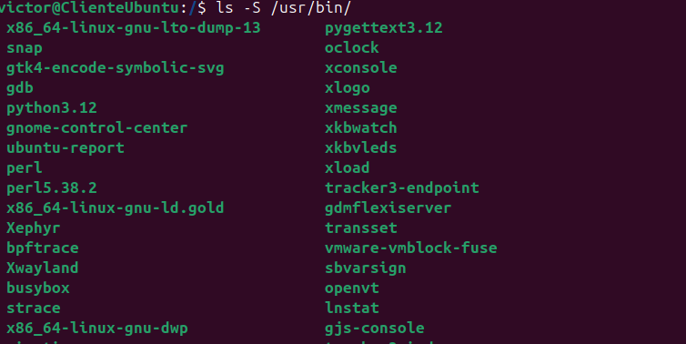

### 10. Muestra todos los archivos del directorio /etc ordenados por tamaño (de mayor a menor) junto con el resto de características, es decir, permisos, tamaño, fechas de la última modificación, etc. El tamaño de cada fichero debe aparecer en un formato “legible”, o sea, expresado en Kb, Mb, etc.

```bash
/$ ls -h -l -S -s /etc/
```
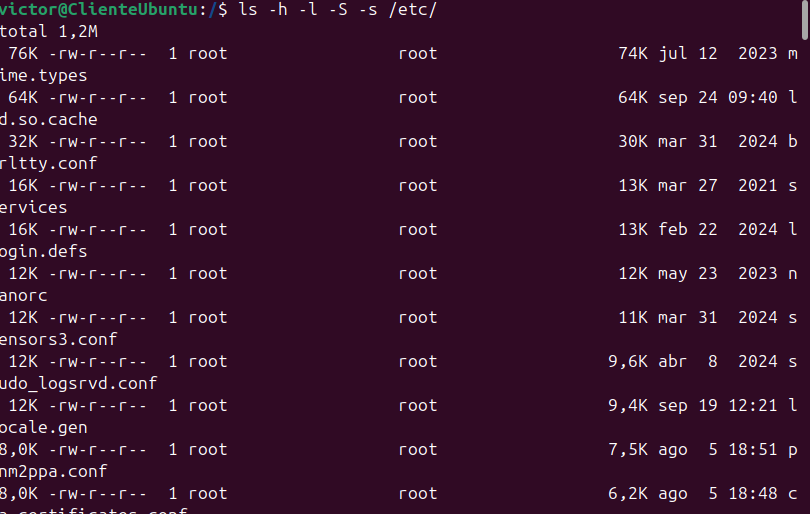

### 11. Muestra todos los archivos del directorio /bin ordenados por tamaño (de menor a mayor). Sólo debe aparecer el tamaño y el nombre de cada fichero, sin ninguna otra información adicional. El tamaño de cada fichero debe aparecer en un formato “legible”, o sea, expresado en Kb, Mb, etc.

```bash
/$ ls -h -Sr -s /bin/
```

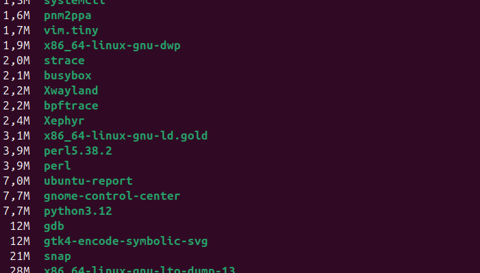

### 12. Muestra el contenido del directorio raíz utilizando como argumento de ls una ruta absoluta

```bash
~$ ls /
```

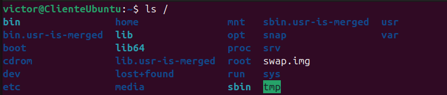

### 13. Muestra el contenido del directorio raíz utilizando como argumento de ls una ruta relativa. Suponemos que el directorio actual es /home/elena/documentos.

```bash
~/Documentos$ ls ../../../
```

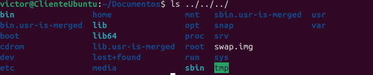

### 14. Crea el directorio gastos dentro del directorio personal.

```bash
~$ mkdir gastos
```

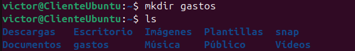

### 15. ¿Qué sucede si se intenta crear un directorio dentro de /etc?

```bash
/etc$ mkdir prueba15
```

No me deja porque no tengo los permisos necesarios. Tendría que hacerlo con el comando `sudo`.

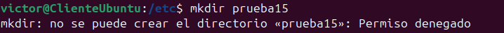

### 16. Muestra el contenido del fichero /etc/fstab

```bash
/$ ls /etc/fstab
```
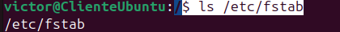

### 17. Muestra las 10 primeras líneas del fichero /etc/bash.bashrc

```bash
/$ head -10 /etc/bash.bashrc
```

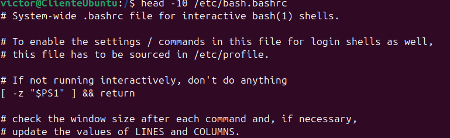

### 18. Crea la siguiente estructura de directorios dentro del directorio de trabajo personal:
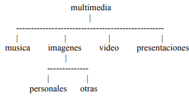

```bash
~$ mkdir multimedia
~$ cd multimedia
~/multimedia$ mkdir musica
~/multimedia$ mkdir imagenes
~/multimedia$ mkdir video
~/multimedia$ mkdir presentaciones
~/multimedia$ cd imagenes
~/multimedia/imagenes$ mkdir personales
~/multimedia/imagenes$ mkdir otras
```
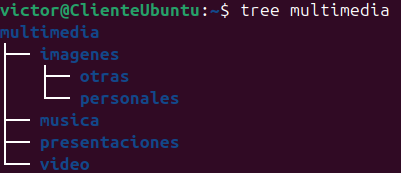

### 19. Crea un fichero vacío dentro del directorio musica, con nombre estilos_favoritos.txt

```bash
~$ touch multimedia/musica/estilos_favoritos.txt
```

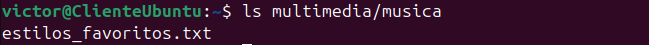
### 20.  Utiliza tu editor preferido para abrir el fichero estilos_favoritos.txt e introduce los estilos de música que más te gusten. Guarda los cambios y sal.

```bash
~/multimedia/musica$ gedit estilos_favoritos.txt
```
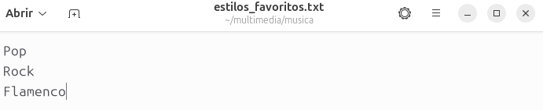

### 21. Muestra todo el contenido de estilos_favoritos.txt

```bash
~/multimedia/musica$ head estilos_favoritos.txt
```
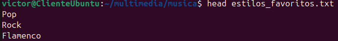


### 22. Muestra las 3 primeras líneas de estilos_favoritos.txt

```bash
~/multimedia/musica$ head -3 estilos_favoritos.txt
```

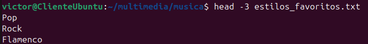

### 23. Muestra la última línea de estilos_favoritos.txt

```bash
~/multimedia/musica$ tail -1 estilos_favoritos.txt
```
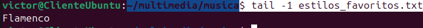

### 24. Muestra todo el contenido del fichero estilos_favoritos.txt excepto la primera línea. Se supone que no sabemos de antemano el número de líneas del fichero.

```bash
~/multimedia/musica$ tail -n +2 estilos_favoritos.txt
```

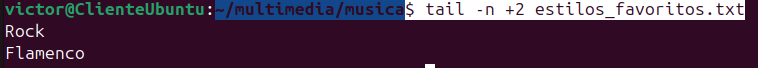


