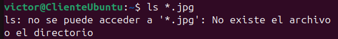

# Ejercicios Linux - Capítulo 3

## Muestra todos los archivos del directorio actual que son imágenes jpg.

```bash
ls *.jpg
```



## Muestra los archivos que empiecen por k y tengan una a en la tercera posición, dentro del directorio /usr/bin.

```bash
ls /usr/bin/k?a*
```


## Muestra los archivos del directorio /bin que terminen en n.

```bash
ls /bin/*n
```


## Muestra todos los archivos que hay en /etc y todos los que hay dentro de cada subdirectorio, de forma recursiva.

```bash
ls -R /etc
```


## Crea un directorio en tu directorio de trabajo con nombre prueba. Copia el archivo gzip del directorio /bin al directorio prueba. Crea un duplicado de gzip con nombre gzip2 dentro de prueba.

```bash
mkdir prueba
cp /bin/gzip prueba
cd prueba/
cp gzip gzip2 
```


## Cambia el nombre de prueba a prueba2. Crea prueba3 en el mismo nivel que prueba2 y mueve todos los ficheros de prueba2 a prueba3. Borra prueba2.

```bash
cd ..
mv prueba prueba2
mkdir prueba3
mv prueba2/* prueba3/
rmdir prueba2 
```

