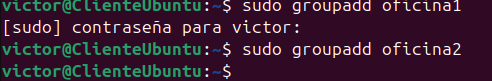

# Ejercicios Linux - Capítulo 4

## Crea los grupos oficina1 y oficina2.

```bash
sudo groupadd oficina1
sudo groupadd oficina2
```



## Crea los usuarios paco y pablo. Estos usuarios deben pertenecer únicamente al grupo oficina1.

```bash
adduser paco --ingroup oficina1
adduser pablo --ingroup oficina1
```


## Crea los usuarios alba y nerea. Estos usuarios deben pertenecer únicamente al grupo oficina2.

```bash
adduser alba --ingroup oficina2
adduser nerea --ingroup oficina2
```


## Como usuario paco Crea un fichero con nombre topsecret.txt en su directorio de trabajo al que
únicamente él tenga acceso, tanto de lectura como de escritura.

```bash
$ su paco
$ cd
$ touch top_secret.txt
$ chmod 600 top_secret.txt 
```


## Crea otro fichero, también como usuario paco, con nombre ventas_trimestre.txt al que tengan
acceso, tanto para leer como para escribir todos los usuarios que pertenezcan al mismo grupo. Se
deben dejar los permisos que haya por defecto para el dueño y para el resto de usuarios. Comprueba
como usuario pablo que puedes modificar el fichero.

```bash
$ touch ventas_trimestre.txt
$ chmod g+rw ventas_trimestre.txt
Comprobamos que el usuario pablo puede modificar este fichero, ya que es miembro del mismo
grupo:
$ exit
$ su pablo
$ vi /home/paco/ventas_trimestre.txt 
```


## Como usuario alba, crea un fichero con nombre empleados.txt al que pueda acceder cualquier
usuario para leer su contenido, y cualquier usuario del mismo grupo para leer o escribir.

```bash
$ exit
$ su alba
$ cd
$ touch empleados.txt
$ chmod 664 empleados.txt 
```


## Copia el fichero empleados.txt al directorio de trabajo de alumno (crea también el usuario
alumno si no está creado). Cambia el propietario y el grupo al que pertenece el fichero, ahora debe ser
alumno.

```bash
$ exit
$ sudo cp /home/alba/empleados.txt /home/alumno/
$ sudo chown alumno /home/alumno/empleados.txt
$ sudo chgrp alumno /home/alumno/empleados.txt

```

